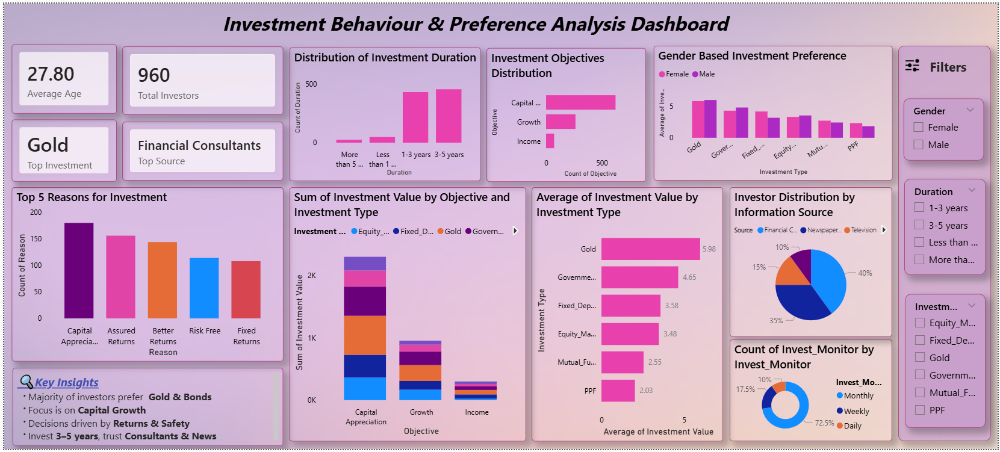

# 📊 Investment Behaviour & Preference Analysis Dashboard

## Interactive Power BI Dashboard for Investment Trend & Investor Preference Analysis

An interactive Power BI dashboard designed to analyze investor behaviour, investment preferences, financial goals, and investment patterns using survey-based financial data.

---

## 🔎 Project Overview

This project focuses on analyzing investment behaviour and preference patterns using Power BI.

The dashboard provides insights into:
- Investment objectives
- Investment duration trends
- Gender-based investment preferences
- Investment monitoring frequency
- Preferred investment sources
- Investment type performance

The goal of this project is to understand investor decision-making patterns and financial preferences through interactive visual analytics.

---

## 📌 Key KPIs

- Total Investors: 960
- Average Age: 27.8
- Top Investment Type: Gold
- Top Information Source: Financial Consultants

---

## 📊 Dashboard Features

- Investment Duration Analysis
- Investment Objective Distribution
- Gender-Based Investment Preference
- Investment Value Analysis
- Information Source Distribution
- Investment Monitoring Analysis
- Interactive Filters using Slicers
- KPI Cards & Comparative Visualizations

---

## 🛠 Tools & Technologies Used

- Power BI
- Power Query
- Data Cleaning
- Data Visualization
- DAX
- Interactive Dashboard Design

---

## 🗂 Dataset Information

The dataset contains:
- Gender
- Age
- Investment Preferences
- Investment Objectives
- Investment Duration
- Investment Source
- Monitoring Frequency
- Investment Type
- Expected Returns
- Investment Reasons

---

## 📈 Key Insights

- Gold and Government Bonds were highly preferred investment options.
- Most investors focused on capital appreciation and returns.
- Financial consultants were the most trusted information source.
- Investors preferred medium-term investments (3–5 years).
- Investment decisions were highly influenced by safety and returns.

---

## 🖼 Dashboard Preview

---

👉 **Watch the demo video here:**  

---

## 📁 Files Included

- Investment_Analysis.pbix
- Dataset.csv
- README.md
- Dashboard Screenshot

---

## 🚀 Project Outcome

This project improved my skills in:
- Power BI Dashboard Development
- Data Visualization
- Business Analysis
- DAX Calculations
- Interactive Reporting
- Financial Data Analytics

---

## 📬 Connect With Me
- LinkedIn: *(www.linkedin.com/in/gitasri-das)*

- 
